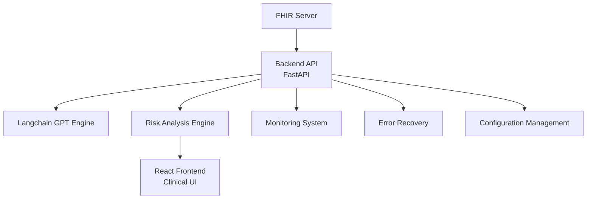

# Smart Clinical Copilot – AI-Enhanced FHIR Healthcare Assistant

---

## ⚠️ Why Smart Clinical Copilot?

In today's healthcare landscape, clinicians face overwhelming patient data, time-critical decisions, and fragmented EHR systems. Smart Clinical Copilot is a powerful tool designed to:

* Decode complex FHIR records in real-time
* Summarize clinical histories and flag risks
* Recommend next steps in diagnostics or treatment
* Provide guardrails for safer, smarter care
* Monitor and analyze patient cohorts
* Manage clinical rules and configurations

This isn't just a project — it's a vision for AI-augmented healthcare that works.

---

## Key Features

| Feature | ⚙️ Description |
| -------------------------- | ------------------------------------------------------------ |
| FHIR Parsing | Deep parsing of patient conditions, encounters, observations |
| GPT-Powered Summarizer | Context-aware summaries of clinical history |
| Drug & Allergy Checker | Real-time alerts from medication and allergy profiles |
| Intelligent Suggestions | Suggests labs, imaging, or follow-ups |
| Visual UI | Fast, focused web dashboard for clinicians |
| Cohort Analytics | Advanced patient cohort analysis and visualization |
| Configuration Management | Flexible system configuration and template management |
| Real-time Monitoring | System health and performance monitoring |
| Error Recovery | Automatic error handling and recovery strategies |

---

## Tech Stack & APIs

| Layer | Technologies |
| ----------- | -------------------------------------- |
| Frontend | React.js, TypeScript, Material-UI, Vite |
| Backend | FastAPI, Python, LangChain |
| AI | OpenAI GPT-4 via Langchain Agents |
| FHIR Access | HL7 FHIR via InterSystems IRIS or HAPI |
| Database | InterSystems IRIS, Redis |
| Monitoring | Prometheus, Grafana |
| Deployment | Docker, GitHub Actions |

---

## Project Structure

```
SmartClinicalCopilot/
├── frontend/                 # React/TypeScript frontend
│   ├── src/
│   │   ├── components/      # Reusable UI components
│   │   ├── pages/          # Main application pages
│   │   ├── hooks/          # Custom React hooks
│   │   ├── context/        # React context providers
│   │   └── lib/            # Utility functions
│   └── public/             # Static assets
├── backend/                 # Python backend
│   ├── api/                # API endpoints
│   ├── services/           # Business logic
│   ├── models/             # Data models
│   ├── utils/              # Utility functions
│   └── tests/              # Test suite
├── docker/                 # Docker configuration
└── docs/                   # Documentation
```

---

## Architecture




* **FHIR Data Ingestion**: Connect to HAPI/IRIS servers or upload JSON
* **AI Engine**: Context-aware reasoning over patient timeline
* **Logic Layer**: Flags warnings, highlights missing labs, etc.
* **Frontend**: Real-time insights in a clean clinical interface
* **Monitoring**: System health and performance tracking
* **Error Recovery**: Automatic error handling and recovery
* **Configuration**: Flexible system configuration management

---

## Quickstart

### 🐳 Docker Installation (Recommended)

1. Prerequisites:
   - Docker Desktop installed and running
   - Git installed
   - OpenAI API key
   - InterSystems IRIS license (for FHIR server)

2. Clone the repository:
```bash
git clone https://github.com/kunal0297/SmartClinicalCopilot.git
cd SmartClinicalCopilot
```

3. Set up environment variables:
```bash
cp .env.example .env
# Edit .env with your configuration
```

4. Start the services:
```bash
docker-compose up --build
```

The application will be available at:
- Frontend: http://localhost:3000
- Backend API: http://localhost:8000
- FHIR Server: http://localhost:9090

### 🛠️ Manual Setup

1. Backend Setup:
```bash
cd backend
python3 -m venv venv
source venv/bin/activate  # or `venv\Scripts\activate` on Windows
pip install -r requirements.txt
uvicorn main:app --reload
```

2. Frontend Setup:
```bash
cd frontend
npm install
npm run dev
```

3. FHIR Server Setup:
```bash
# Follow InterSystems IRIS installation guide
# or use HAPI FHIR server
```

---

## Development Guidelines

1. **Code Style**:
   - Frontend: Follow TypeScript best practices
   - Backend: Follow PEP 8 guidelines
   - Use meaningful commit messages

2. **Testing**:
   - Write unit tests for new features
   - Run tests before committing
   - Maintain test coverage

3. **Documentation**:
   - Document new features
   - Update API documentation
   - Keep README up to date

---

## Real-World Use Cases

* Emergency Room triage support
* Neurology - follow-up safety alerts
* Drug dosing checks in elderly patients
* Chronic disease dashboards (diabetes, CHF)
* Clinical research data filtering (e.g., trial matching)
* Patient cohort analysis
* Clinical rule management
* System monitoring and alerting

---

## Project Vision

> "We believe AI can be a safety net, not a risk — Smart Clinical Copilot makes clinical reasoning safer, faster, and more complete."

Upcoming Features:
* Integration with voice (Whisper + GPT)
* Audit trails and explainability logs
* Custom scoring for condition severity
* Enhanced cohort analytics
* Advanced configuration management
* Improved error recovery strategies

---

## Resources

* [FHIR Overview (HL7)](https://www.hl7.org/fhir/overview.html)
* [LangChain AI Agents](https://docs.langchain.com/)
* [IRIS FHIR API Docs](https://docs.intersystems.com/irislatest/csp/docbook/Doc.View.cls?KEY=FHIR)
* [Material-UI Documentation](https://mui.com/)
* [FastAPI Documentation](https://fastapi.tiangolo.com/)

---

## License

MIT — see [LICENSE](./LICENSE)

---

## 💬 Contact

**Team Kunal0297**

📧 kunalpandey0297@gmail.com
🌐 [GitHub](https://github.com/kunal0297/SmartClinicalCopilot)

---

## 🏑 Final Note

If healthcare data is the fuel of modern medicine, Smart Clinical Copilot is your AI-powered engine — extracting life-saving insights when it matters most.

**Use it. Improve it. Trust it.**
