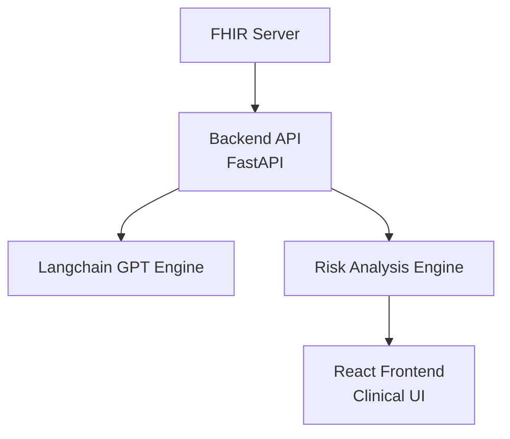

#  Smart Clinical Copilot – AI-Enhanced FHIR Healthcare Assistant


---

## ⚠️ Why Smart Clinical Copilot?

In today’s healthcare landscape, clinicians face overwhelming patient data, time-critical decisions, and fragmented EHR systems. Smart Clinical Copilot is a powerful tool designed to:

* Decode complex FHIR records in real-time
* Summarize clinical histories and flag risks
* Recommend next steps in diagnostics or treatment
* Provide guardrails for safer, smarter care

This isn’t just a project — it's a vision for AI-augmented healthcare that works.

---

##  Key Features

|  Feature                 | ⚙️ Description                                               |
| -------------------------- | ------------------------------------------------------------ |
|  FHIR Parsing            | Deep parsing of patient conditions, encounters, observations |
|  GPT-Powered Summarizer  | Context-aware summaries of clinical history                  |
|  Drug & Allergy Checker  | Real-time alerts from medication and allergy profiles        |
|  Intelligent Suggestions | Suggests labs, imaging, or follow-ups                        |
|  Visual UI               | Fast, focused web dashboard for clinicians                   |

---

##  Tech Stack & APIs

| Layer       | Technologies                           |
| ----------- | -------------------------------------- |
| Frontend    | React.js, TailwindCSS, Vite            |
| Backend     | FastAPI, Python, LangChain             |
| AI          | OpenAI GPT-4 via Langchain Agents      |
| FHIR Access | HL7 FHIR via InterSystems IRIS or HAPI |
| Deployment  | Docker, GitHub Actions                 |

---

##  Architecture




* **FHIR Data Ingestion**: Connect to HAPI/IRIS servers or upload JSON
* **AI Engine**: Context-aware reasoning over patient timeline
* **Logic Layer**: Flags warnings, highlights missing labs, etc.
* **Frontend**: Real-time insights in a clean clinical interface

---

##  Sample Flow

### Input (FHIR Data Extract):

```json
{
  "resourceType": "Patient",
  "name": [{ "family": "Singh", "given": ["Asha"] }],
  "condition": [{ "code": "I10", "description": "Hypertension" }],
  "medicationStatement": [
    { "medicationCodeableConcept": { "text": "Lisinopril" }, "status": "active" }
  ]
}
```

### Output (Copilot Response):

*  Chronic condition detected: Hypertension
*  Missing labs: No recent renal function or BP data
*  Medication: Lisinopril — check potassium levels
*  Suggested actions: Order CBC, ECG; monitor BP trends

---

##  AI Modules in Action

| Module                    | Description                                     |
| ------------------------- | ----------------------------------------------- |
| 🗌 Clinical Summarizer    | Highlights relevant history in seconds          |
|  Diagnostic Agent       | Suggests labs or imaging tests                  |
|  Risk Checker            | Flags allergies, med conflicts, abnormal vitals |
|  Encounter Reviewer     | Connects encounter timelines, symptoms, labs    |
|  Conversational Copilot | Future-ready chat-based medical assistant       |

---


##  Demo Video

>  Watch Smart Clinical Copilot in action:

[](./demo.mp4)

> *Note: Demo file is uploaded directly to the root, not inside a subfolder.*

---

##  Quickstart

###  Docker (Recommended)

```bash
git clone https://github.com/kunal0297/SmartClinicalCopilot.git
cd SmartClinicalCopilot
docker-compose up --build
```

### 🛠️ Manual Setup

```bash
# Backend
cd backend
python3 -m venv venv
source venv/bin/activate
pip install -r requirements.txt
uvicorn main:app --reload

# Frontend
cd frontend
npm install
npm run dev
```

---

##  Real-World Use Cases

*  Emergency Room triage support
*  Neurology - follow-up safety alerts
*  Drug dosing checks in elderly patients
*  Chronic disease dashboards (diabetes, CHF)
*  Clinical research data filtering (e.g., trial matching)

---

##  Project Vision

> “We believe AI can be a safety net, not a risk — Smart Clinical Copilot makes clinical reasoning safer, faster, and more complete.”

Upcoming:

*  Integration with voice (Whisper + GPT)
*  Audit trails and explainability logs
*  Custom scoring for condition severity

---

##  Resources

* [FHIR Overview (HL7)](https://www.hl7.org/fhir/overview.html)
* [LangChain AI Agents](https://docs.langchain.com/)
* [IRIS FHIR API Docs](https://docs.intersystems.com/irislatest/csp/docbook/Doc.View.cls?KEY=FHIR)

---

##  License

MIT — see [LICENSE](./LICENSE)

---

## 💬 Contact

**Team Kunal0297**

📧 kunalpandey0297@gmail.com
🌐 [GitHub](https://github.com/kunal0297/SmartClinicalCopilot)

---

## 🏑 Final Note

If healthcare data is the fuel of modern medicine, Smart Clinical Copilot is your AI-powered engine — extracting life-saving insights when it matters most.

**Use it. Improve it. Trust it.**
