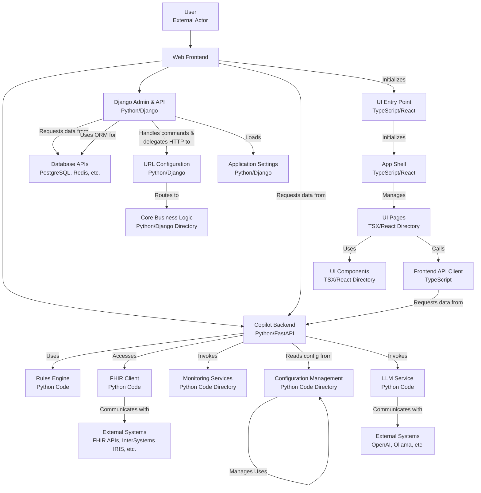

# 🏥 Smart Clinical Copilot

<div align="center">

[](https://opensource.org/licenses/MIT)
[](https://www.python.org)
[](https://fastapi.tiangolo.com)
[](https://reactjs.org)
[](https://www.docker.com)
[](https://www.hl7.org/fhir)

An AI-powered clinical decision support system that helps healthcare providers make better decisions by providing real-time clinical insights and recommendations.

[Features](#features) • [Architecture](#architecture) • [Quick Start](#quick-start) • [Development](#development) • [Contributing](#contributing)

</div>

## ✨ Features

<div align="center">

| Category | Features |
|:--------:|:---------|
| 🏥 **Clinical Support** | • Real-time clinical decision support<br>• Rule-based alerting system<br>• Patient risk assessment<br>• Medication safety checks |
| 🔄 **Integration** | • FHIR integration for healthcare data<br>• IRIS for Healthcare integration<br>• Multi-system interoperability<br>• Real-time data synchronization |
| 💻 **User Interface** | • Modern, responsive web interface<br>• Intuitive clinical dashboard<br>• Real-time alerts and notifications<br>• Customizable views |
| 🛠️ **Technical** | • Docker-based deployment<br>• Scalable microservices architecture<br>• High-performance data processing<br>• Secure data handling |

</div>

## 🏗️ Architecture

The system consists of the following components:

<div align="center">



</div>

### Core Components

- **Frontend**: React-based web interface with Material-UI
- **Backend**: FastAPI-based API server with Python
- **FHIR Server**: HAPI FHIR server for healthcare data
- **IRIS**: InterSystems IRIS for Healthcare integration
- **Database**: PostgreSQL for data persistence
- **Rule Engine**: Custom rule processing system
- **Monitoring**: System health and performance tracking

## 🚀 Quick Start

### Prerequisites

- Docker and Docker Compose
- Git
- Node.js (for local development)
- Python 3.9+ (for local development)
- PostgreSQL (for production)
- Redis (for caching and session management)

### Installation

1. **Clone the repository:**
   ```bash
   git clone https://github.com/kunal0297/SmartClinicalCopilot.git
   cd SmartClinicalCopilot
   ```

2. **Create a `.env` file in the backend directory with the following content:**
   ```env
   # Environment
   ENVIRONMENT=development

   # API Settings
   HOST=0.0.0.0
   PORT=8000

   # Database
   DATABASE_URL=postgresql://postgres:postgres@db:5432/clinical_copilot

   # FHIR Server
   FHIR_SERVER_URL=http://hapi.fhir.org/baseR4

   # LLM Settings
   LLM_API_KEY=your-api-key-here
   LLM_MODEL=mistral

   # Redis Settings
   REDIS_URL=redis://redis:6379/0

   # Security
   SECRET_KEY=your-secret-key-here
   ACCESS_TOKEN_EXPIRE_MINUTES=11520  # 8 days

   # Monitoring
   ENABLE_METRICS=true
   METRICS_PORT=9090

   # Logging
   LOG_LEVEL=INFO
   ```

3. **Build and start the Docker containers:**
   ```bash
   docker-compose build
   docker-compose up
   ```

4. **Access the services:**
   - Frontend: [http://localhost:3000](http://localhost:3000)
   - Backend API: [http://localhost:8000](http://localhost:8000)
   - FHIR Server: [http://localhost:8080](http://localhost:8080)
   - IRIS Management Portal: [http://localhost:52773](http://localhost:52773)

## 💻 Development

### Backend Development

1. **Set up the environment:**
   ```bash
   python -m venv venv
   source venv/bin/activate  # Linux/Mac
   venv\Scripts\activate     # Windows
   ```

2. **Install dependencies:**
   ```bash
   cd backend
   pip install -r requirements.txt
   ```

3. **Run the development server:**
   ```bash
   cd backend
   uvicorn main:app --reload
   ```

### Frontend Development

1. **Install dependencies:**
   ```bash
   cd frontend
   npm install
   ```

2. **Run the development server:**
   ```bash
   npm run dev
   ```

## 🤝 Contributing

We welcome contributions! Please follow these steps:

1. Fork the repository
2. Create a feature branch (`git checkout -b feature/AmazingFeature`)
3. Commit your changes (`git commit -m 'Add some AmazingFeature'`)
4. Push to the branch (`git push origin feature/AmazingFeature`)
5. Open a Pull Request

### Development Guidelines

- Follow PEP 8 for Python code
- Use TypeScript best practices for frontend code
- Write meaningful commit messages
- Include tests for new features
- Update documentation as needed

## 📚 Documentation

- [API Documentation](http://localhost:8000/docs)
- [Frontend Documentation](./frontend/README.md)
- [Backend Documentation](./backend/README.md)
- [Deployment Guide](./docs/deployment.md)

## 🔒 Security

- All data is encrypted in transit and at rest
- Role-based access control
- Regular security audits
- HIPAA compliance measures

## 📄 License

This project is licensed under the MIT License - see the [LICENSE](LICENSE) file for details.

## 📞 Contact

**Team Kunal0297**
- Email: kunalpandey0297@gmail.com
- GitHub: [@kunal0297](https://github.com/kunal0297)

---

<div align="center">

Made with ❤️ by Team Kunal0297

</div>
